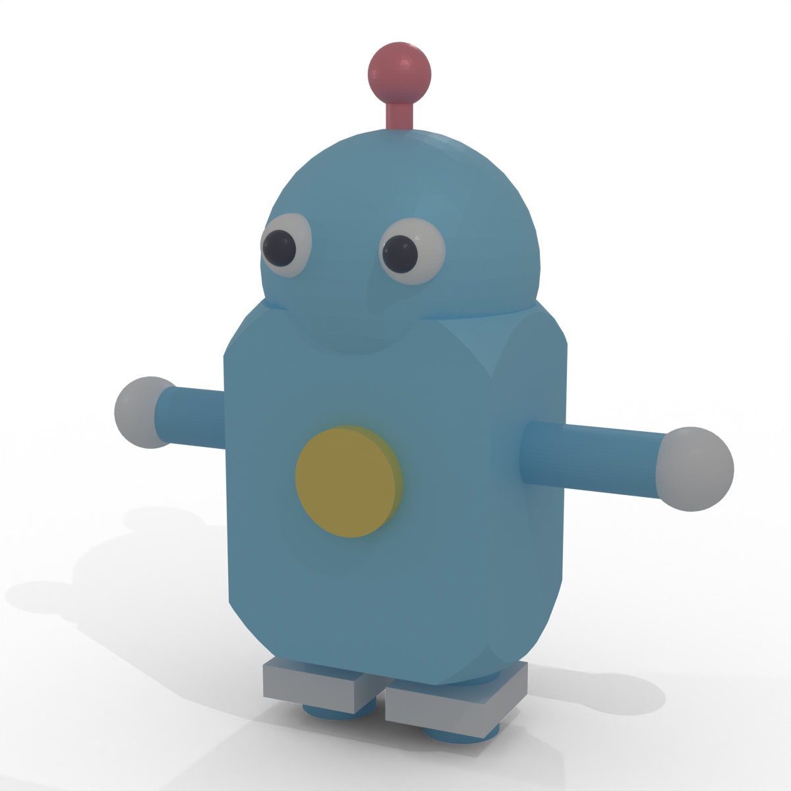

# vcad

Parametric CAD in Rust. Define parts with CSG operations and export to STL, glTF, USD, and DXF.

<p align="center">
  
</p>

Built on [manifold](https://github.com/elalish/manifold) for boolean operations and mesh generation.

## Quick start

```rust
use vcad::{centered_cube, centered_cylinder, Part};

// Plate with four mounting holes
let plate = centered_cube("plate", 100.0, 60.0, 5.0);

let hole = centered_cylinder("hole", 3.0, 10.0, 32);
let holes = hole.translate(-40.0, -20.0, 0.0)
    .union(&hole.translate(40.0, -20.0, 0.0))
    .union(&hole.translate(-40.0, 20.0, 0.0))
    .union(&hole.translate(40.0, 20.0, 0.0));

let part = plate.difference(&holes);
part.write_stl("plate.stl").unwrap();
```

## Features

**Primitives** — cube, cylinder, cone, sphere, centered variants

**CSG** — union, difference, intersection

**Transforms** — translate, rotate, scale

**Export formats:**

| Format | Use case | Feature flag |
|--------|----------|--------------|
| STL | 3D printing, CNC | always on |
| glTF/GLB | Web viewers, PBR materials | `gltf` (default) |
| USD/USDA | Isaac Sim, Omniverse | `usd` |
| DXF | Laser cutting (2D profiles) | always on |
| STEP | Interchange (requires OCCT) | `step` |

**Materials** — PBR material database loaded from TOML, with part-to-material assignments.

**Scenes** — Multi-part assemblies that preserve per-part materials for rendering.

## Installation

```toml
[dependencies]
vcad = "0.1"
```

Without glTF support:

```toml
[dependencies]
vcad = { version = "0.1", default-features = false }
```

## Examples

### Boolean operations

```rust
use vcad::{centered_cube, centered_cylinder, Part};

let block = centered_cube("block", 30.0, 30.0, 20.0);
let bore = centered_cylinder("bore", 10.0, 25.0, 64);
let result = block.difference(&bore);
```

### Bolt pattern

```rust
use vcad::{centered_cube, bolt_pattern};

let flange = centered_cube("flange", 80.0, 80.0, 6.0);
let holes = bolt_pattern(6, 60.0, 5.5, 10.0, 32);
let part = flange.difference(&holes);
```

### Multi-material scene (glTF)

```rust
use vcad::{Part, Scene};
use vcad::export::{Materials, export_scene_glb};

let materials = Materials::parse(r#"
    [materials.steel]
    color = [0.7, 0.7, 0.72]
    metallic = 0.9
    roughness = 0.4

    [materials.rubber]
    color = [0.1, 0.1, 0.1]
    metallic = 0.0
    roughness = 0.9
"#).unwrap();

let mut scene = Scene::new("assembly");
scene.add(Part::cube("frame", 100.0, 50.0, 30.0), "steel");
scene.add(
    Part::cylinder("wheel", 20.0, 10.0, 32).translate(60.0, 0.0, 0.0),
    "rubber",
);

export_scene_glb(&scene, &materials, "assembly.glb").unwrap();
```

### DXF for laser cutting

```rust
use vcad::export::DxfDocument;

let mut doc = DxfDocument::new();
doc.add_rectangle(100.0, 60.0, 0.0, 0.0);  // outer profile
doc.add_circle(0.0, 0.0, 15.0);             // center hole
doc.add_circle(-35.0, 0.0, 3.0);            // mounting hole
doc.add_circle(35.0, 0.0, 3.0);             // mounting hole
doc.add_bend_line(-50.0, 20.0, 50.0, 20.0); // bend (BEND layer)
doc.export("bracket.dxf").unwrap();
```

### Materials from TOML

```toml
# materials.toml
[materials.aluminum_6061]
color = [0.85, 0.85, 0.88]
metallic = 0.95
roughness = 0.35
density = 2700
description = "6061-T6 Aluminum"

[materials.abs_black]
color = [0.08, 0.08, 0.08]
metallic = 0.0
roughness = 0.7
density = 1040

[part_materials]
frame = "aluminum_6061"
cover = "abs_black"
```

```rust
use vcad::export::Materials;

let mats = Materials::load("materials.toml").unwrap();
let frame_mat = mats.get_for_part("frame").unwrap();
assert_eq!(frame_mat.name, "aluminum_6061");
```

## Units

vcad is unit-agnostic — coordinates are just `f64`. By convention, the projects using vcad treat values as millimeters (matching STL/DXF conventions for manufacturing).

## License

[MIT](LICENSE)
